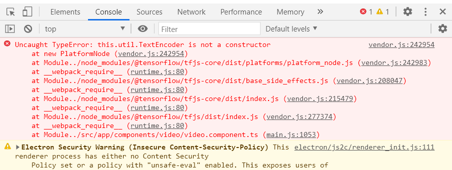

# ElectronNg-CocoSsd
The title stands for:
* [Electron](https://www.electronjs.org/) (or ElectronJS) is the main tool to create the desktop app.
* NG stands for [Angular](https://angular.io/). This project also uses [Angular Material](https://material.angular.io/). These are the framework used to create the contents of the web app.
* COCO-SSD is the model used for obtect detection. [COCO](https://cocodataset.org/#home) stands for `Common Object in Context` and SSD stands for `Single Shot (Multibox) Detection`. The model used here is a [Tensorflow.js](https://www.tensorflow.org/js/models) port of [COCO-SSD model](https://github.com/tensorflow/tfjs-models/tree/master/coco-ssd). 


## How to run the app
Run `npm install` on the terminal to install all required dependencies.

Run `npm run electron-aot` to optimize building the Angular app using AOT(Ahead-Of-Time) compiler, and dumping the web files(index.html, js files, css, pluralmap.csv, etc) on `ngbuild` folder. I changed the build folder to `ngbuild` on angular.json. After this, it will run Electron as a desktop app. 

Please see package.json how I summarized CLI commands.
```
  "scripts": {
    "ng": "ng",
    "start": "ng serve",
    "build": "ng build",
    "test": "ng test",
    "lint": "ng lint",
    "e2e": "ng e2e",
    "electron": "electron .",
    "electron-dev": "ng build && electron .",
    "electron-aot": "ng build --prod && electron .",
    "package-mac": "electron-packager . --overwrite --platform=darwin --prune=true --out=packages",
    "package-win": "electron-packager . --overwrite --platform=win32 --prune=true --out=packages",
    "package-linux": "electron-packager . --overwrite --platform=linux --prune=true --out=packages"
  },
```

## How to run the app in development and debugging mode
You can run the Angular app using the default `ng serve` and see it on the browser on `http://localhost:4200/` but all Electron/NodeJS logic will not be executed. If you just need to check on Angular Material or anything related to aesthetics this is just fine. 

Or you can also do debugging by going to the `main.js`, an Electron entry point, and change the `dev` variable to `true`. Then run `npm run electron`. This will run the Electron dekstop app and will display `http://localhost:4200/`. Everything you changed and saved on the Angular code will be updated immediately on the Electron app as if it was the browser.  

## How to package Electron as a standlone app
I summarize the commands on package.json on how to package the app as distributables. You could certainly add mode parameters to these as you want. Please refer to [Electron packager tutorial](https://www.christianengvall.se/electron-packager-tutorial/) and 
[electron-packager](https://electron.github.io/electron-packager/master/) for reference.

##### **Linux**
```
npm run package-linux
```
##### **Windows**
```
npm run package-win
```
>There is a different procedure on how to package a Windows distributable on non-Windows platforms. You should see this [reference](https://github.com/electron/electron-packager#building-windows-apps-from-non-windows-platforms).

##### **Mac**
```
npm run package-mac
```
The different packages for each of these OS platforms will be outputted on `packages` folder.

## My solution to node_module error

If you encounter this error, this is just my take or work around on how I solved the issue. Please open the file in `node_modules\@tensorflow\tfjs-core\dist\platforms\platform_node.js` and make some minor changes on the code as shown below. I made changes on 2 lines of code.
##### **From this code**
```
...
export class PlatformNode {
    constructor() {
        // tslint:disable-next-line:no-require-imports
        this.util = require('util');
        // According to the spec, the built-in encoder can do only UTF-8 encoding.
        // https://developer.mozilla.org/en-US/docs/Web/API/TextEncoder/TextEncoder
        this.textEncoder = new this.util.TextEncoder();
    }
    fetch(path, requestInits) {
        if (env().global.fetch != null) {
            return env().global.fetch(path, requestInits);
        }
        if (systemFetch == null) {
            systemFetch = getNodeFetch.importFetch();
        }
        return systemFetch(path, requestInits);
    }
    now() {
        const time = process.hrtime();
        return time[0] * 1000 + time[1] / 1000000;
    }
    encode(text, encoding) {
        if (encoding !== 'utf-8' && encoding !== 'utf8') {
            throw new Error(`Node built-in encoder only supports utf-8, but got ${encoding}`);
        }
        return this.textEncoder.encode(text);
    }
    decode(bytes, encoding) {
        if (bytes.length === 0) {
            return '';
        }
        return new this.util.TextDecoder(encoding).decode(bytes);
    }
}
...
```
##### **To this code**
```
...
export class PlatformNode {
    constructor() {
        // tslint:disable-next-line:no-require-imports
        this.util = require('util');
        // According to the spec, the built-in encoder can do only UTF-8 encoding.
        // https://developer.mozilla.org/en-US/docs/Web/API/TextEncoder/TextEncoder
        // this.textEncoder = new this.util.TextEncoder();
      }
      fetch(path, requestInits) {
        if (env().global.fetch != null) {
          return env().global.fetch(path, requestInits);
        }
        if (systemFetch == null) {
          systemFetch = getNodeFetch.importFetch();
        }
        return systemFetch(path, requestInits);
      }
      now() {
        const time = process.hrtime();
        return time[0] * 1000 + time[1] / 1000000;
      }
      encode(text, encoding) {
        if (encoding !== 'utf-8' && encoding !== 'utf8') {
          throw new Error(`Node built-in encoder only supports utf-8, but got ${encoding}`);
        }
        this.textEncoder = new this.util.TextEncoder();
        return this.textEncoder.encode(text);
      }
      decode(bytes, encoding) {
        if (bytes.length === 0) {
          return '';
        }
        return new this.util.TextDecoder(encoding).decode(bytes);
    }
}
...
```

## Description of the app
This object detection app is made from Electron so it can run as a desktop app in all three major OS platforms, that is Windows, Linux and Mac.  

Eventhough Tensorflow.js is made particularly for Javascript coding and deployed as a web app, this desktop app will have the ability to open an image file, video file, webcam, and screen capture for inference testing. A feature which is lacking on a typical wep application. 

The [COCO dataset](https://cocodataset.org/#home) consists of [80 classes of objects](https://github.com/tensorflow/tfjs-models/blob/master/coco-ssd/src/classes.ts). There is a feature on the app that I count the number of classes per prediction. I made sure that it can pluralize the class label if it is counted greater than 1. Prediction is done on a frame by frame basis in the case of a video file, webcam, or screen capture being loaded on the app. And a model prediction will return bounding boxes (x,y,width,and height in pixels) with class name and confidence level. It will then be drawn on a canvas, in realtime, and will be overlayed on the main video or image itself.

The underlying wep app on this Electron app is made from Angular and Angular Material. It has a special logic on how to execute NodeJS file system  within Angular.
##### **Everything within this block will be designated for Electron/NodeJS code**
```
if (ElectronLogic) {
  //Do Node JS file system
}
```


This project was generated with [Angular CLI](https://github.com/angular/angular-cli) version 8.3.22.

## Development server

Run `ng serve` for a dev server. Navigate to `http://localhost:4200/`. The app will automatically reload if you change any of the source files.

## Code scaffolding

Run `ng generate component component-name` to generate a new component. You can also use `ng generate directive|pipe|service|class|guard|interface|enum|module`.

## Build

Run `ng build` to build the project. The build artifacts will be stored in the `dist/` directory. Use the `--prod` flag for a production build.

## Running unit tests

Run `ng test` to execute the unit tests via [Karma](https://karma-runner.github.io).

## Running end-to-end tests

Run `ng e2e` to execute the end-to-end tests via [Protractor](http://www.protractortest.org/).

## Further help
To get more help on the Angular CLI use `ng help` or go check out the [Angular CLI README](https://github.com/angular/angular-cli/blob/master/README.md).
